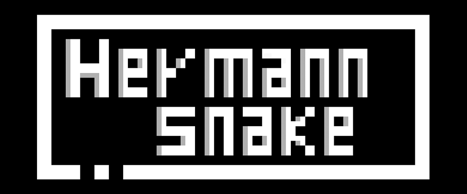

Hermann Snake is a game I made during April 2021 Black and White game jam. The theme of the jam was to create a game completely in black and white.

I found that using a black and white optical illusion was a perfect way to utilize the theme of the jam as a game mechanic itself. In the context of a snake game, by using the optical illusion of a Hermann Grid, there's the illusion that there are multiple apples for the snake. 

By varying the number of blocks and the constraint of the snake possible path, the player can choose the preferred style of playing.

I chose Pico8 for this game because I thought it fit the idea of the game best. You can look at the game code [here](https://github.com/chiarabia/Hermann-Snake).

You can play Hermann Snake [here](https://chiarabianchimani.itch.io/hermann-snake).

